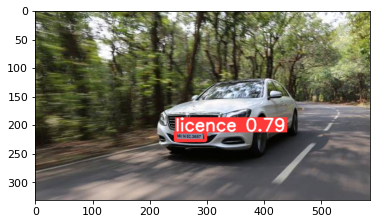
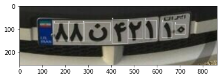
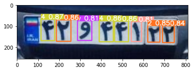
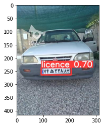
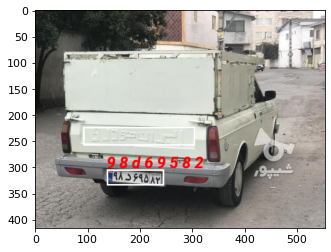

# Car-license-plate-detection-

# plate detection
**The first step** 
------
Based on the project requirements, we initially trained the model using a dataset of car images obtained from the Kaggle website, applying the YOLO algorithm to accurately detect each car's license plate.
A key step in this process involves converting the file format (from XML, containing coordinates of two points on the bounding rectangle around each license plate and the class of each object) to TXT format. The main point in this conversion is transforming the coordinates to obtain the center coordinates of the rectangle, along with its width, height, and the class types present in the image. In this stage, there is only one class, as we are focused solely on license plate detection.
After downloading the dataset and converting the labeling format of the images, we proceed to train the model using the YOLO algorithm.
Another important point in using the YOLO network is creating a file with a YAML extension, in which the dataset image paths and the classes to be mapped in the network should be specified.
Once the model is trained, the resulting weights from the model are saved, and we evaluate the model using test images from the dataset. It can be observed that the bounding rectangles accurately identify the license plates in the images.
The stored weights will later be used for the final license plate detection and, for convenience, will be transferred to Google Drive.

**The Second step** 
----
In the second stage, using the dataset provided to us, we need to extract the characters of Iranian car license plates.
To accomplish this, due to the large dataset size, we created a downloadable link for the dataset file via a Telegram bot and then uploaded it to the Colab environment using the necessary commands.
After accessing the dataset file, we found that, in addition to the folder containing license plate images, there is also a folder with JSON-format labels for each image. As in the first stage, we need to convert this format into one compatible with the YOLO algorithm for training the network.
After the format conversion, we can draw bounding boxes around each license plate based on the classes and coordinates specified for each plate.

In this stage, we also need to define classes for the numbers and letters on the license plates, totaling 37 classes. Besides the classes, the image and label paths must be saved in a YAML file to be utilized by the YOLO algorithm.
The network is trained using YOLOv5s, which provides satisfactory accuracy. After completing the training process, this network generates weights, which we store in Google Drive for later use.
The obtained model can then be evaluated using test images to assess its performance.

**The Third step** 
------
In the third stage, we need to combine both models obtained from the previous steps. This means first detecting the car's license plate and then, using the second model, extracting the plate's characters.
To achieve this, we used the dataset available from Kaggle, focusing on images of Iranian cars. For detection, we need the YAML files and network weights generated by the previous models, so we transfer these files stored in Google Drive to the Colab environment.
First, we use the weights from the license plate detection model to identify license plates on cars and draw bounding rectangles around them.

It is observed that the first model effectively detects license plates on new images.
In the next step, we build the second model using the weights from the network responsible for character extraction. Now, we feed the detected license plate from the first model into the second model to extract the characters from it.

**Final step** 
------

At this stage, the task of character extraction is completed. For the next step, we can feed a video into the model, where each frame is processed by the models to extract license plate information. A bounding rectangle is drawn around each plate, and each processed frame is saved in a folder.
The saved frames are then compiled back into a video, completing the license plate detection process.
The files containing the code and the video are attached to this report.

